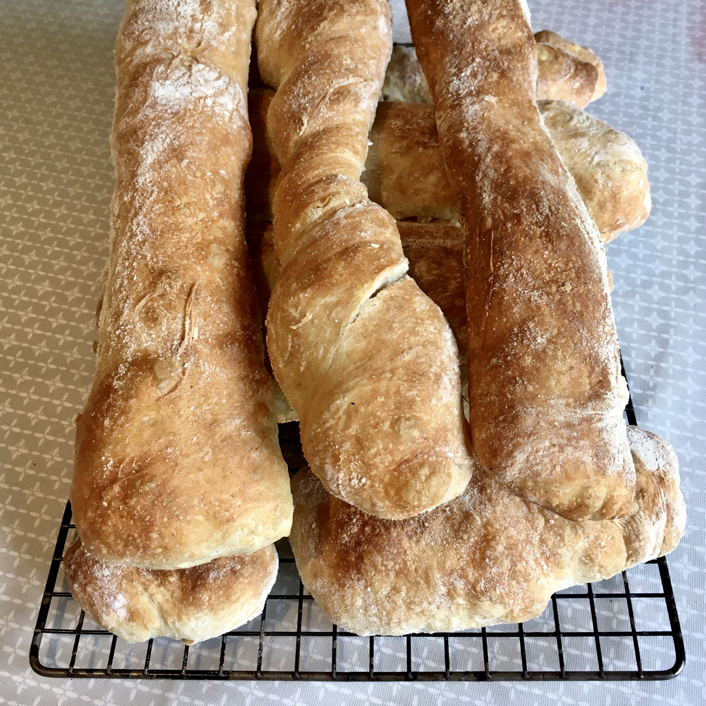

# Ciabatta

### 

### Ingredients

* 500g strong white flour \(Shipton Mill has Ciabatta flour\)
* 10g salt
* 400g water
* 6g of fresh yeast \(or half the amount of dried\)
* a splash of olive oil

### Baker's percentages

Weights of each ingredient relative to flour \(standard\) 

* strong white flour
* 2% salt
* 80% water
* 1.2% fresh yeast
* 5% olive oil 

### Method

#### Make the dough, let it rest and fold

There is not much work here, but it takes a long time between steps \(1h waiting between folds\)... so make sure you have time to see the recipe through to the end.

1. Weigh out the flour and salt
2. In a large bowl, weigh out the water and yeast and combine.
3. Add the flour and salt to the water and mix until everything is combined in a dough
4. The dough is very wet, but trust the process, it all works out in the end 😀 
5. Put the oil in a large bowl \(I use a square plastic cake carrier / food container\) and place the dough in there.
6. Cover and let the dough rest of 1h
7. Fold the dough, each of the four sides across \(top edge to bottom, bottom edge to top, then rotate the container by 90º and repeat\) and flip the down, such that the seam is at the bottom
8. Repeat steps 6 and 7 three more times, each time waiting for an hour.

#### Pre-heat oven, shape the dough, rest briefly and bake

1. Preheat the oven to 250ºC \(or even hotter if your oven can do it\)
2. Flour the work top very well and also generously flour the dough
3. Gently flip the dough out of the container onto the work surface \(to keep all the bubbles\)
4. Using a dough scraper, cut into long "loafer" shapes or smaller squares \(rolls\)
5. Flour a baking tray and place the ciabatta on there
6. Let dough rest for 5 \(max 10\) minutes
7. Bake at 250ºC for about 15 \(or until they have a the colour you like\)
8. Enjoy!

### Notes

The quantities are for a batch of 3-4 small loaves. If you have lot's of bread eaters in the house or are expecting guests, double or triple the quantities. When the dough rises it develops lots of big bubbles and can take up quite a bit of space. \(For 3x the basic recipe quantities, it will fill a big plastic cake carrier \(5 litre capacity\). 

Surprising fact: ciabatta was only invented in 1982 \([https://en.wikipedia.org/wiki/Ciabatta](https://en.wikipedia.org/wiki/Ciabatta)\)

