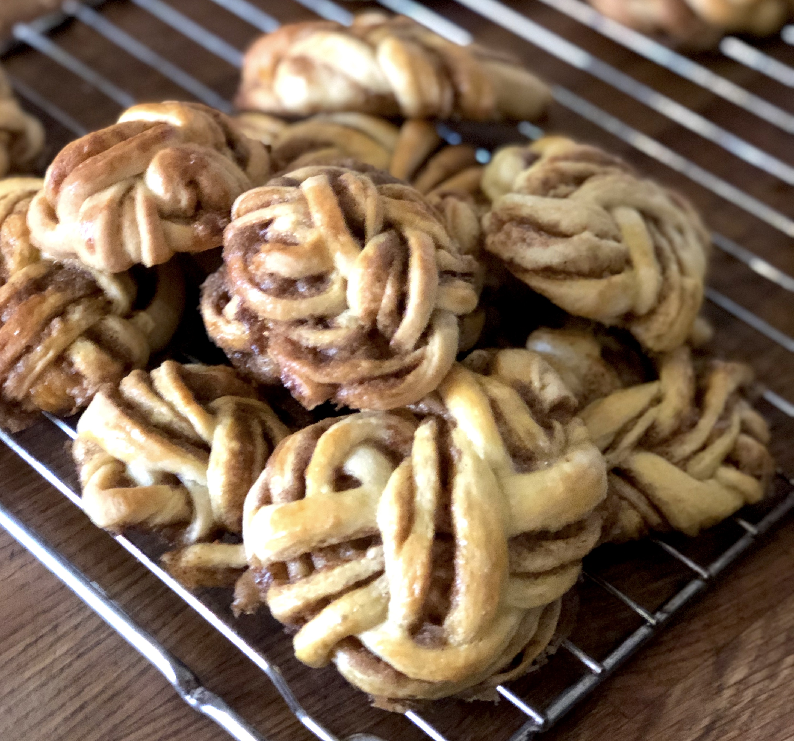

# Cinnamon Buns \(Bertinet's best\)

A simple recipe for a cinnamon buns that looks like £1m.

### Ingredients 

makes 24; bake in a cupcake tray or on a flat sheet

* 600g strong white flour
* 10g salt
* 200g full fat milk 
* 2 eggs
* 25g fresh yeast \(or 12g\)
* 50g caster sugar
* 200g unsalted butter / softened

for filling

* 150g unsalted butter / softened
* 250g soft brown sugar
* 2 tsp cinnamon

### Method 

#### Make the dough 

* put milk and eggs into mixer \(dough hook works best for this\)
* add the dry ingredients \(flour, sugar, salt\) and use some of the flour to rub the yeast into small pieces to disperse more easily
* add softened butter on top
* mix on slowest speed for 4 minutes \(until combined\)
* increase speed to 3 \(on KitchenAid\) and mix for another 8 minutes
* rest the dough for 45 minutes to let it develop

#### Make the filling

* using a paddle attachment, mix together butter, sugar and cinnamon
* set aside

#### Shape the cinnamon buns

check out the video below to see how Richard Bertinet does it... fun to watch



