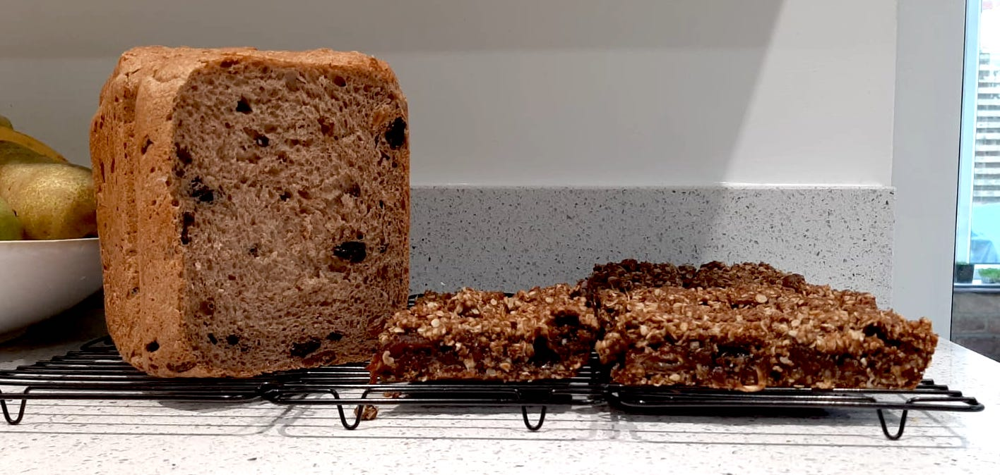

# Date and Oat Fruit Loaf

### Ingredients

Makes about 15-20 squares

* 150g unsalted butter \(+ some extra for greasing pan\)
* 500g chopped, stoned dates \(use Medjool if you can\)
* 200 ml water
* 1 tsp vanilla extract
* 150g wholemeal flour
* a pinch of salt
* 200g rolled oats
* 1/2 tsp baking soda
* 2 tbsp wheatgerm \(optional\)
* 120 g light brown sugar
* 1 tsp molasses
* 2 tbsp of golden syrup

### Method

* preheat oven to 180ªC, Gas Mark 4
* butter a 20cm by 28cm tin \(and line with baking parchment\)
* put dates and 200ml of water in a saucepan, gentle heat and stir occasionally until all the water is absorbed
* stir in vanilla extact
* in a separate bowl mix flour, salt, oats and baking soda \(dry ingredients\)
* in a saucepan, gently heat butter, add molasses, golden syrup \(wet ingredients\)
* pour wet ingredients into dry and mix until you get a crumbly consistency
* layer half that mixture into the base of the prepared tin
* then add dates as a middle layer
* ... and sprinkle over the other half of the dough
* bake for about 30 minutes or until golden brown
* let cool in the tin and the slice and enjoy! 
* Yum!

### Notes

Next stop "Rose Bakery"  – [https://london.doverstreetmarket.com/rose-bakery](https://london.doverstreetmarket.com/rose-bakery)

