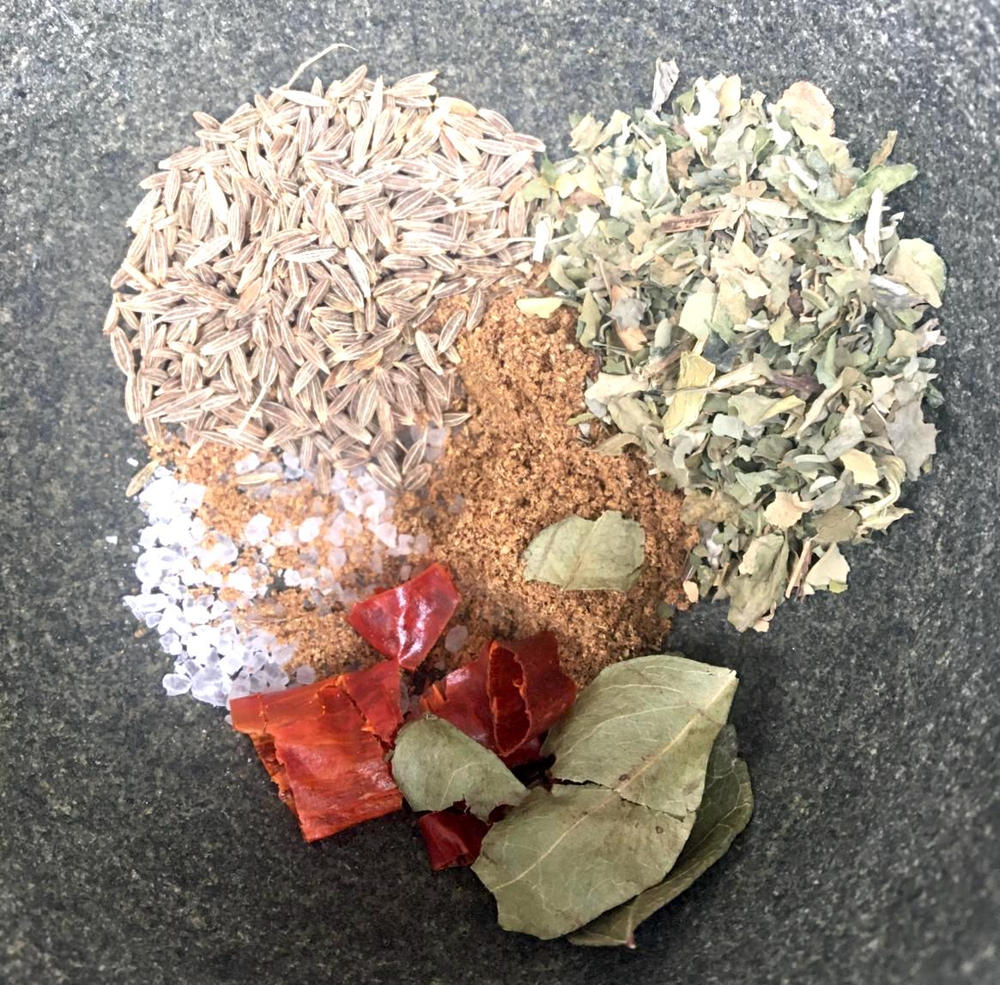
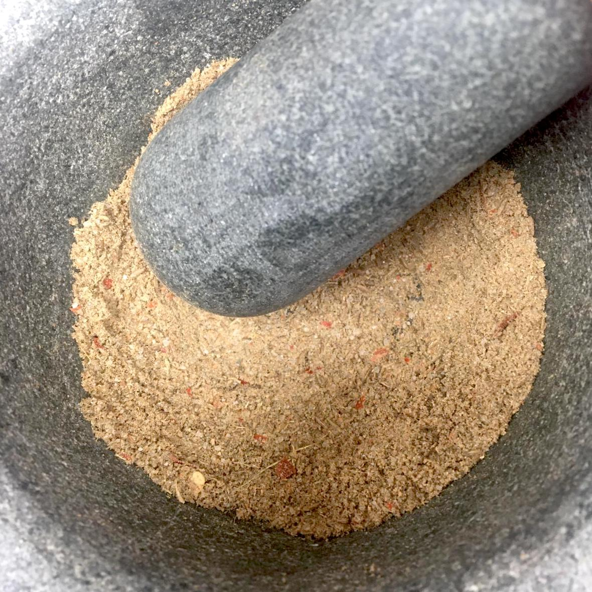

# Indian savoury scones

### Ingredients

makes 6

* 250g self raising flour 
* 1tsp baking powder 
* 125g butter 
* 1 large egg 
* 5 tbsp milk 
* 20g fresh coriander 
* Curry leaves and mustard seeds to decorate \(optional\) 
* Spice mix:
  * 2 tsp cumin seeds
  * 1 tsp Garam masala
  * 1/2 tsp rock salt
  * 2 tsp dried fenugreek leaves
  * fresh or dried chillies to your taste!

### Method

1. Grind the spice mix in a pestle and mortar.
2. Blitz the flour and butter to breadcrumb consistency in a food mixer \(or by hand!\)
3. Add the spice mix and finally the other ingredients \(not mustard seeds or curry leaves\) and blitz to a dough consistency
4. Roll out to 2cm depth, cut your scones.
5. Brush tops with a little milk and sprinkle with mustard seeds and add 1 curry leaf per scone.
6. Bake at 180ºC for 12-15 mins 
7. Serve with pickles \(I love aubergine!\), chutneys or a bowl of red lentil dhal 

#### Spice mix, before and after

   

### Notes

Photo credits: Anya

